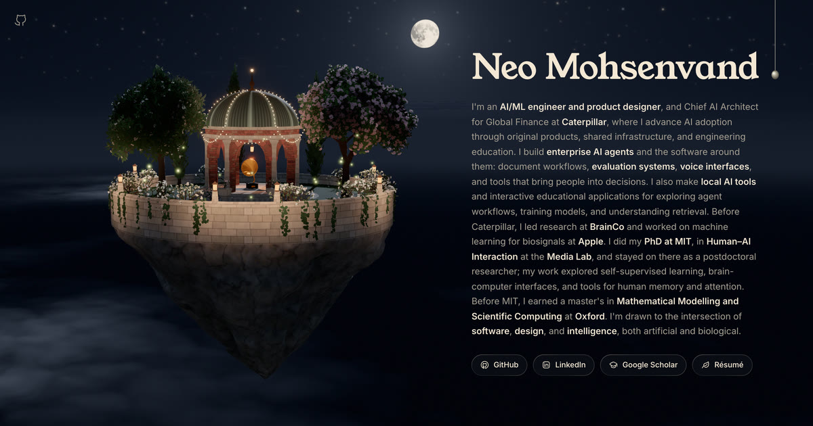

# The grove, in three dimensions



This branch (`grove-3d`) rebuilds the homepage as a SvelteKit site with a
three.js scene behind it: a garden on a floating rock at golden hour, over a
sea of cloud, turning to the blue hour when the lamp cord is pulled.

```bash
npm install
npm run dev        # http://localhost:5173 (the launch config uses 5188)
npm run build      # static site in build/, every page prerendered
npm run check      # svelte-check
```

URL parameters, for looking at things: `?hour=12` (golden hour) or `?hour=22`
(blue hour) overrides the clock, and `?seed=31` fixes the garden's layout.

## The page

`src/routes/+page.svelte` lays the page's sections over a fixed canvas.
Everything the page shows is data in `src/lib/data/` and components in
`src/lib/components/`: the hero, résumé, work, papers (with the reading
room's flight), media, earlier work, and the lamp cord, which switches the
theme. The canvas is `Scene.svelte`, which loads the engine lazily behind the
veil (the tesseract in `app.html`) and lifts the veil when the first frame is
drawn.

## The engine — `src/lib/grove/`

| File                                       | What it is                                                                                                                                                                                                                                                                                                                                                                                                                      |
| ------------------------------------------ | ------------------------------------------------------------------------------------------------------------------------------------------------------------------------------------------------------------------------------------------------------------------------------------------------------------------------------------------------------------------------------------------------------------------------------- |
| `engine.ts`                                | The `Grove`: renderer, camera and layout, the light rig, the frame loop, input, adaptive resolution.                                                                                                                                                                                                                                                                                                                            |
| `sky.ts`                                   | The sky. A single-scattering atmosphere (Rayleigh, Mie, ozone; Schüler's Chapman approximation) summed into a sky-view table when the sun moves; a sea of cumulus ray-marched through a baked height field, with low-sun shadows; altocumulus overhead. By night, stars, a moonlit sea, and the old site's moon (`static/media/moon.svg`), drawn at full resolution over the sky and setting behind the cloud as the day comes. |
| `island.ts`                                | The limestone wall, the crag the island is broken from, the lawn, the flags, the wall lanterns.                                                                                                                                                                                                                                                                                                                                 |
| `rotunda.ts`                               | Six open brick arches on stone columns, a leaded dome with verdigris, and the lantern hung from the dome's middle, whose spotlight throws the gramophone's shadow forward across the floor.                                                                                                                                                                                                                                     |
| `gramophone.ts`, `notes.ts`                | The machine, and the golden notes that come out of it on the music's loudness.                                                                                                                                                                                                                                                                                                                                                  |
| `flora/`                                   | The garden (below).                                                                                                                                                                                                                                                                                                                                                                                                             |
| `air.ts`                                   | Doves by day, perching and flying in bounds; fireflies by night, wandering the garden and flashing.                                                                                                                                                                                                                                                                                                                             |
| `present.ts`                               | The last pass: sharpens the picture before the browser stretches it to the screen, then encodes and dithers it.                                                                                                                                                                                                                                                                                                                 |
| `fairylights.ts`                           | The strings of bulbs on the rotunda, and the lamp on the finial.                                                                                                                                                                                                                                                                                                                                                                |
| `glow.ts`                                  | The fireflies' and lanterns' light, laid each frame into a small map over the island that every lit surface reads once.                                                                                                                                                                                                                                                                                                         |
| `textures.ts`, `texgen.ts`, `texworker.ts` | Every texture, drawn procedurally: brick, ashlar, rock, flags, lawn, bark, walnut. The four heaviest are drawn in two workers while the page builds the rest, and handed back as raw pixels.                                                                                                                                                                                                                                    |
| `masonry.ts`                               | Surfaces of revolution laid course by course, with whole bricks to a course.                                                                                                                                                                                                                                                                                                                                                    |

### The garden

Trees are grammars read by a 3D turtle (`flora/turtle.ts`, `flora/species.ts`),
with tropism, gnarl and a level roll. Radii come from the tips down by the pipe
model, and leaves grow only on the terminal shoots and spurs. The species are
the olive, the Italian cypress, two flowering shrubs, and ivy.

- **Leaves** are real blades, cupped and drooping. Thousands are instanced from
  one template, silver beneath, glowing when backlit (`flora/foliage.ts`).
- **The light inside the crowns.** A voxel grid over the whole island holds
  leaf area, and Beer–Lambert gives every leaf and piece of bark its view of the
  sky (`flora/canopy.ts`).
- **Wind** leans each plant about its foot, by an angle weighted by height, with
  a smooth sway field and each leaf turning on its stalk. A CPU mirror keeps
  perched doves on their twigs (`flora/wind.ts`).
- **A touch** sends a gust through the crown from where the hand went in,
  shakes petals loose (`flora/petals.ts`), and sets the doves in it flying.
  A tree can be grabbed and bent; it springs back and rings down.
- **The rotunda** is kept clear: the olives are pruned back from it as they
  grow, and a bent crown comes up against the building and stops.

The ideas behind the leaves, canopy light and wind come from Elia Boutorabi's
[Arbor](https://github.com/eliaboutorabi/trees). The code here is written
fresh for WebGL; none of it is copied.

### The picture

The scene is drawn in linear HDR into a multisampled half-float buffer. One
`postprocessing` pass then does mipmap bloom, AgX tone mapping and a gentle
grade. The sky is drawn into its own smaller sheet and laid behind the scene,
from a camera that never turns: when a hand turns the view, the island turns
under a still sky (the sun's light turning with it), and the moon and stars
stay where they are. Shadows update every other frame, and hold still while
the page scrolls. The thinned leaves that cast the crowns' shadows live on a
layer of their own; three's shadow pass tests layers against the picture's
camera, so the engine opens that layer to it only for the length of each
shadow pass (`gateShadowLayer`).

### Keeping to 60 fps

`adapt()` trades pixel ratio for frame time, judged against the display's
own refresh (so a 120 Hz screen counts a 12 ms frame as a miss), and never
while the page is scrolling. Below the fold, at rest, the scene is paced down
to 20 fps, since only the sky shows there. Phones get fewer leaves
and fewer rows per blade. At phone size, and on desktop at a pixel ratio of
1.5, the scene holds 60 fps on an Apple-silicon Mac in headless Chromium (with
Metal ANGLE) and WebKit. Real phones still need checking by hand.

## Notes for whoever works on it next

- **Shaders.** Never write `smoothstep(a, b, x)` with `a > b`. GLSL leaves it
  undefined and ANGLE on Metal returns 0, so use `1.0 - smoothstep(b, a, x)`.
- **Materials.** Every lit material goes through `nightPatch` in `shared.ts`.
  That is where the night's blue and the glow map are applied, so a new
  material should go through it too.
- **Testing.** The headless screenshots and walkthroughs used to build this
  were Playwright scripts. Chromium needs `--use-angle=metal`, or the sky
  crawls in SwiftShader.
