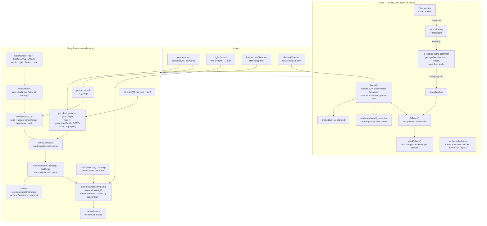
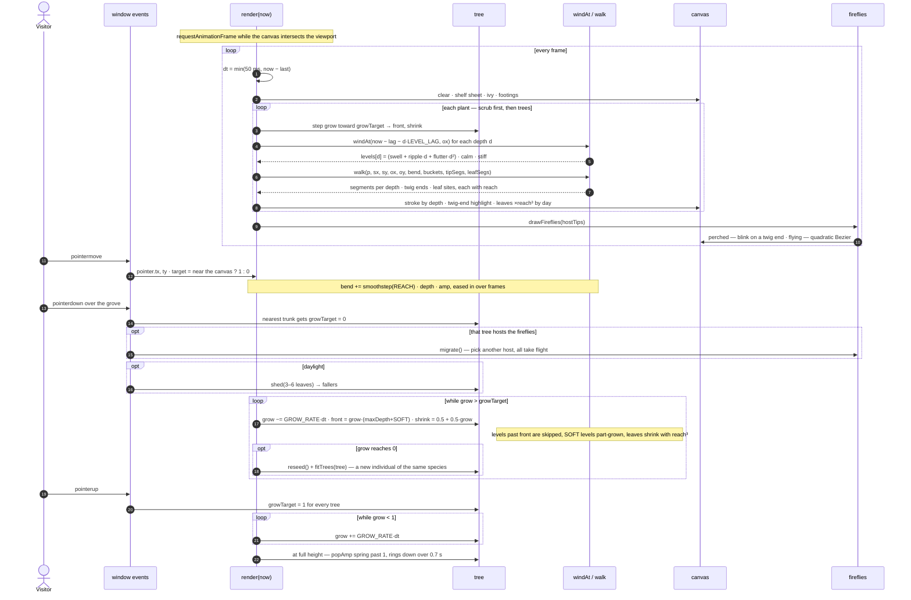

# neovand.github.io

Personal homepage — a gallery of interactive demos, simulations, and tools.

**Live site:** https://neovand.github.io


## Structure

```
/               ← gallery homepage
/media/         ← thumbnails, and the moon behind the grove
/media/fonts/   ← Inter, self-hosted (SIL Open Font License, see OFL.txt)
/media/legacy/  ← figures for the older projects, shown in their modals
/media/mit/     ← Media Lab project thumbnails, local copies
/media/papers/  ← first five pages of each paper, rendered for the deck fans
/papers/        ← the PDFs themselves
/archive/       ← original Three.js network visualization (preserved)
```

Every image the page loads is served from this repo. Nothing hotlinks, and
nothing on the critical path comes from a third-party origin.

## The sky

The page does not have a background colour so much as weather. One full-screen
fragment shader sits behind the whole document: by day a cloudscape built from
a gyroid FBM — the same family of noise as Leon Denise's [Cloudy Blue
Sky](https://www.shadertoy.com/view/DlKXWm), with its scrolling blue-noise
texture dropped in favour of a wider threshold, so cloud edges dissolve rather
than fizz and nothing has to be downloaded — and by night a thin star field
crossed by the Milky Way, which arrives as a crowding of stars rather than a
grey smear, with a meteor every half-minute or so.

It runs at half the display's rate on a buffer capped well under a retina
viewport's worth of pixels, stops entirely when the tab is hidden, and draws a
single still frame under `prefers-reduced-motion`. If WebGL is unavailable the
flat `--bg` underneath is all you get, and nothing else changes.

## The grove

The header is a canvas of five L-system trees over a thicket of smaller ones,
each grammar giving a different silhouette. They bend under a shared wind field
built from layered value noise, sampled a little later at each branching level
so a gust travels up the plant instead of swinging every part at once. Moving
the pointer pushes them aside; pressing a tree makes it withdraw into itself,
twigs first, and releasing grows it back. Fireflies perch on one tree's twig
ends and cross to another when their tree is disturbed.

In daylight each species carries its own foliage: a leaf shape and a green,
baked into small sprites at twelve angles and three variants, so a branch end
costs one blit rather than a path. How far in the canopy reaches is measured
per species from its own twig spacing — the five grammars differ enough that a
fixed depth leaves one bald and turns another into a solid lump — and the inner
levels are drawn from a shaded copy of the same leaves, which is what stops a
dense tree reading as a green tube. Each segment records how far out it has
grown, and its leaf is scaled by the cube of that, so pressing a tree shrinks
the foliage away with the twigs instead of switching it off leaf by leaf.

The moon is the CC0 "full moon" drawing by gnokii (Open Clipart, via Wikimedia
Commons), which requires no attribution. It is also the favicon, rendered over
a night ground with the same glow it has on the page.

### How it fits together

Everything below lives in one script in `index.html`, under the heading
`Grove: L-system trees under a shared wind`. The expensive work — expanding
the grammars, dealing each tree its reading, fitting the stand to the column,
baking sprites — happens once at load and again on resize; a frame is one
`walk()` per plant, driven by the wind field, the pointer and each tree's
growth, and the segments it collects are stroked straight onto the canvas.



### A frame, and a press

The loop only runs while the canvas is on screen. A press picks the nearest
trunk and sends its `growTarget` to zero; the tree draws itself back in at a
fixed rate, so a tree with more branching levels takes the same time as one
with fewer, and letting go sends every tree back up with a small overshoot
that rings down.



## The glass

The profile links and the filter chips are panes of glass rather than tinted
rectangles. Three things make the difference: a rim gradient painted into a
one-pixel ring by masking a box against its own content box (a border cannot
hold a gradient), two inner lights along the top and bottom edges, and a
refraction at the rim.

The refraction is an SVG displacement map built per element, at load and on
resize, from that element's own rounded-rect signed distance field — neutral
grey through the middle, ramping toward the outward normal inside a band at
the edge, so the backdrop is sampled from further out the nearer the rim and
piles up there the way it does under real glass. Only Chromium will run an SVG
filter inside a `backdrop-filter`, so it arrives through a custom property that
script sets and no other engine ever receives. That property is declared empty
in `:root` on purpose: without a declared default, `var()` on an undefined
property is invalid at computed-value time and would take the whole
`backdrop-filter` with it, blur included.

Two things kept daylight from looking like glass. The ring sat one pixel inside
the pane, because an absolutely positioned box is offset from its container's
*padding* box and these carried a transparent border — so the edge was a pixel
of plain tint next to a pixel of ring, twice as thick as it should be. And the
ring was white at both ends, which against a white pane is not an edge but an
outline. On a bright ground the sides of real glass show the darker, compressed
view through the bevel and only two short arcs catch the light, so that is what
the daylight rim does now.

The gallery cards are panes in both themes. A solid card on a sky is a hole cut
in the weather. Their tint and blur were picked by measurement rather than by
eye: a star in this sky is about one device pixel across, so blur destroys it
quadratically while transparency only costs it linearly — at 3.5px barely a
tenth survived, at 1.8px about half does. Daylight has far more room, since the
description text still measures near 6:1 against the frost at half the tint it
started with, so the cloud comes through much more than it did.

## On a phone

Below 900px the page stacks: the grove above the words, both the width of the
screen. The grove takes its height from the screen there — about half of the
first one, capped — so the trees stand at the same proportions they have
beside the bio on a wide screen, and a phone plants four or five of them
rather than squeezing in the wide screen's five to eight.

The bio writes itself over the finished paragraph rather than into it: the
text is all there from the first frame, laid out once, and the part not yet
typed is painted with no colour through a CSS custom highlight, with the caret
carried along as a separate box. Typing by truncating the text nodes re-broke
the lines on every frame under `text-wrap: pretty` — Safari re-solves the whole
paragraph — which on a twenty-line column read as the bio shivering. Browsers
without the Highlight API get the older way, under greedy breaking.

The lamp cord hangs from the top of the *page* on a stacked layout, over the
grove, and scrolls away with it — fixed to the window it rode down over the
right end of every line. A tap on the knob switches the lights on a touch
screen; dragging still works, but a short drag on a phone is how the page
scrolls. The four profile links stay one row, a size down, with Google Scholar
going by its surname; the filter chips are one strip that scrolls, and the one
you tap is brought to the middle of it. `viewport-fit=cover` lets the sky run
under the notch and the home bar, with the content held inside the safe area,
so a phone held sideways no longer shows a strip of the flat fallback colour
either side of the weather.

To try it on a real phone without deploying: serve the folder and open the
Mac's address on the phone over the same Wi‑Fi —

```bash
python3 -m http.server 8899
```

then `http://<your-mac's-ip>:8899/` (System Settings → Wi‑Fi → Details shows
the address; `ipconfig getifaddr en0` prints it). Safari's Web Inspector will
attach to the phone from the Mac's Develop menu. Playwright's WebKit build is a
fair stand-in for Mobile Safari when a device is not to hand.

## The section flourishes

The dividers between sections are one calligraphic ornament, split into its
seventeen component strokes. Each is pivoted on the end that joins the middle
and delayed by how far out it sits, so when the divider scrolls into view the
flourish unrolls from the centre and the terminal spirals arrive last.

In daylight it stops being ink and becomes a branch: brown where it leaves the
middle, green out at the curls, with leaves hung along it. The leaves are grown
on the left half only — anchored on points sampled from the strokes' own
outlines, so each one sits on the ink rather than beside it — and mirrored
across the centre, because a figure this symmetrical shows any drift at once.
They are in the markup at night too, painted with nothing: removing them would
throw off the measurement that decides how the flourish unrolls.

The ornament is from a text-divider set by Vecteezy. **Free Vecteezy downloads
require attribution** — check the licence on the original download and add the
credit it asks for, or swap in an asset that does not need one.
