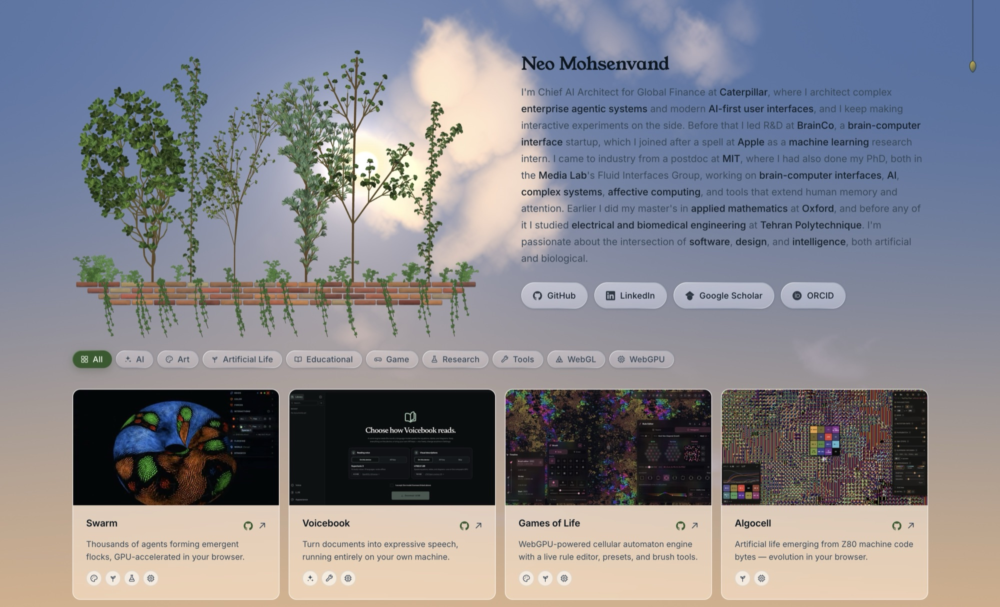
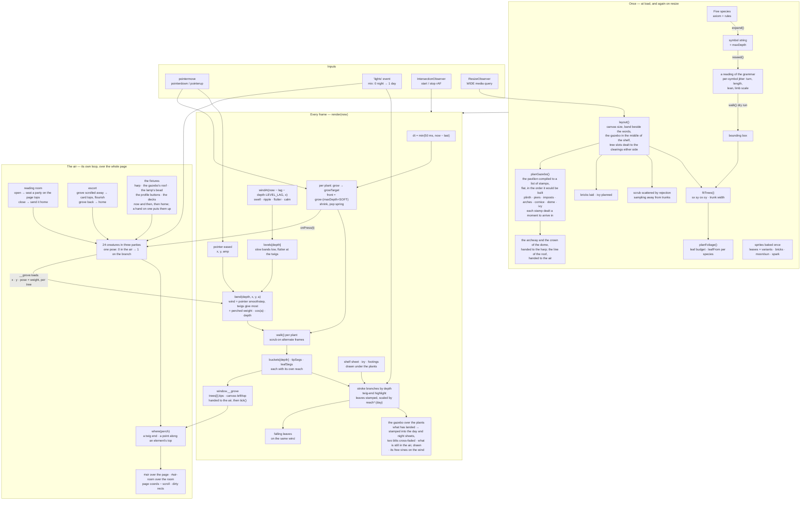
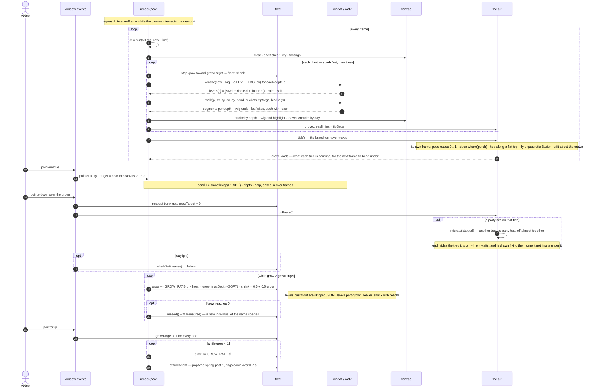

# neovand.github.io

Personal homepage — a gallery of interactive demos, simulations, and tools.

**Live site:** https://neovand.github.io



## Structure

```
/               ← gallery homepage
/media/         ← thumbnails, the moon behind the grove, the harp, and its
                  two pieces of music
/media/fonts/   ← Inter, self-hosted (SIL Open Font License, see OFL.txt)
/media/legacy/  ← figures for the older projects, shown in their modals
/media/mit/     ← Media Lab project thumbnails, local copies
/media/papers/  ← first five pages of each paper, rendered for the deck fans
/papers/        ← the PDFs themselves
/archive/       ← original Three.js network visualization (preserved)
```

Every image the page loads is served from this repo. Nothing hotlinks, and
nothing on the critical path comes from a third-party origin. The two pieces
of music are the only heavy things here, and neither is fetched until somebody
plays the harp.

## The sky

The page does not have a background colour so much as weather. One full-screen
fragment shader sits behind the whole document: by day a cloudscape built from
a gyroid FBM — the same family of noise as Leon Denise's [Cloudy Blue
Sky](https://www.shadertoy.com/view/DlKXWm), with its scrolling blue-noise
texture dropped in favour of a wider threshold, so cloud edges dissolve rather
than fizz and nothing has to be downloaded — and by night a thin star field
crossed by the Milky Way, which arrives as a crowding of stars rather than a
grey smear, with a meteor every half-minute or so.

It runs at half the display's rate on a buffer capped well under a retina
viewport's worth of pixels, stops entirely when the tab is hidden, and draws a
single still frame under `prefers-reduced-motion`. If WebGL is unavailable the
flat `--bg` underneath is all you get, and nothing else changes.

## The grove

The header is a canvas of five or six L-system trees over a thicket of smaller
ones, each grammar giving a different silhouette, standing in two clearings
either side of a brick pavilion.

Everything built on this canvas is cut to **one brick**. The shelf and the
gazebo standing on it are the same wall in the end, out of the same three
kilns, and a brick is a brick: it does not get larger because the thing built
out of it is. The shelf's used to be laid four courses to a button's height
whatever that came to — twenty-eight pixels long against the pavilion's
eighteen — and the two read as different masonry standing on top of each
other. One course height is fixed on the screen now, and both of them derive
everything from it: how many courses the shelf takes to reach the thickness it
has to be, how many bricks go in a course, and how wide the joints are. The
shelf gained a bed of mortar with it, which it never needed at the old size
and cannot do without at this one — a joint with the sky showing through it is
not a joint.

What that brick is made of comes out of one table, and there are two entries
in it. Fired clay is what the grove is built of, both of them, always. Marble
is the other, tried and not kept: by day it is a beautiful thing, and by night
it goes the same grey everything else does and gives back nothing for what the
red was worth. Its first cut was worse than that — it had a blue-grey bed and
a darker one, which is what a real quarry gives you and what an elevation this
size cannot take, since at six pixels a block a cool grey reads as a hole and a
dark one as a patch. It is kept because the swapping is the interesting part,
and it is not a recolour: a
pale stone needs a pale mortar or every joint reads as a black grid ruled over
the front of it; a cooler, lighter edge, or the blocks come out lined in soot;
almost no grit, because a dressed stone has none; a vein instead of a firing
blotch, a vein being the one mark only marble has; and a far steeper night
curve. `?stone=marble` has a look at it.

The trees bend under a shared wind field
built from layered value noise, sampled a little later at each branching level
so a gust travels up the plant instead of swinging every part at once. Moving
the pointer pushes them aside; pressing a tree makes it withdraw into itself,
twigs first, and releasing grows it back. Two parties of birds — fireflies,
after dark — sit up on the crowns of two of the trees and cross to another
when theirs is pressed, or when they feel like it (see [The air](#the-air)).

In daylight each species carries its own foliage: a leaf shape and a green,
baked into small sprites at twelve angles and three variants, so a branch end
costs one blit rather than a path. How far in the canopy reaches is measured
per species from its own twig spacing — the five grammars differ enough that a
fixed depth leaves one bald and turns another into a solid lump — and the inner
levels are drawn from a shaded copy of the same leaves, which is what stops a
dense tree reading as a green tube. Each segment records how far out it has
grown, and its leaf is scaled by the cube of that, so pressing a tree shrinks
the foliage away with the twigs instead of switching it off leaf by leaf.

The moon is the CC0 "full moon" drawing by gnokii (Open Clipart, via Wikimedia
Commons), which requires no attribution. It is also the favicon, rendered over
a night ground with the same glow it has on the page.

### The gazebo

In the middle of the shelf, with the stand around it, there is a garden
pavilion, and the harp stands in it. It is a brick building of three bays on a
levelled plinth — an entrance in the middle with a keystone over it, a window
either side of it, a pier between each — under a dentilled cornice and a brick
dome, with ivy over the whole of it and a few pale roses
in the ivy. It is laid in the same fired clay as the shelf it stands on, out
of the same three kilns; a third of the size, since a brick is a brick and
what changes with the building is how many of them there are.

**It is drawn flat, in elevation, exactly as the trees beside it are.** It was
not at first. It was an octagon in perspective, seven plan-radii from the eye,
every course dealt round a circle, and that version was more faithful and much
worse. Perspective was the author of every fault it had: bricks foreshortened
to slivers along the edge of the dome; walls and piers meeting at planes that
would not reconcile, leaving a wedge of daylight down each corner; courses
whose left half could not agree with their right; a footprint whose near
corners sat lower in the picture than its far ones, so the building stood on a
rocker over a shelf that is a straight line. None of those are drawing faults.
They are what a third dimension costs, and the picture it stands in does not
have one.

Flat, they all go away, and they go away by construction rather than by care.
Every course is a horizontal band. Every band is dealt an exact number of
bricks that fill it corner to corner, with a half-bat at each end on the
alternate courses — real bond, and its own mirror. Every joint is centred in
its own pitch rather than taken off one side. Every arch has an odd number of
voussoirs, so there is a keystone on the centre line and the two halves match.
And every measurement in the file is a function of |x|. So the left of the
building is the mirror of the right, brick for brick, and no joint can open
anywhere — not because anything checks, but because there is nothing for a gap
to come from.

Six things then had to be got right.

**Room for the rings.** An arch ring lands on the impost and runs its own depth
out onto the pier either side — that is what a turned arch does, and it is why
a pier between two arches has to be wide enough to carry both rings with a
piece of spandrel left between them. It was not. At 0.18 of the half-width
across it took a ring's depth from each side with less than nothing left over,
so the entrance ring and the window ring beside it met *inside* the pier and
overlapped by a few pixels — two rings crossing, which is the one thing on this
building that cannot be read as brickwork at all. The bays are set out from
that constraint now: the piers are wider, the windows narrower, the entrance
takes the deeper ring and its windows the shallower one (a smaller arch gets a
shallower ring in real work too), and both depths are then held to whatever
spandrel the pier can actually give them — a course is a larger share of a
small pavilion than of a large one, so at the small end the rings give way
rather than meet.

**One course.** A brick wall has one bed joint height and every course in it
lines up right across the front. This one did not: the piers were coursed on
their own height and the walls beside them on theirs, so wherever the two met
the joints ran past each other by a pixel or two, all the way up — the kind of
fault you cannot name but can see. The course is worked out once now, from the
size the pavilion has been given (bricks about six pixels tall whatever that
size is, so a small one is not a model of a large one — it is the same brick,
and there are fewer of them), and then every height in the building is rounded
to a whole number of them: the plinth, the balustrade, its coping, the impost
the arches spring from, the cap on the piers, and each band of the
entablature. Nothing moves more than half a course from where it was drawn,
and every bed joint on the facade becomes one line. The entablature is given
a floor in courses as well as a proportion, because an architrave one course
deep is an architrave and one half a course deep is a line.

**Mortar.** The shelf can do without it — its bricks lie on a solid course and
the gaps between them read as shadow — but a wall standing in the sky cannot:
every joint was a slot of daylight. Every course now goes on a bed of mortar
cut to its own outline, laid a little proud at the top so the band above
covers the overshoot.

**Cutting.** A wall with an arch in it, and a dome, are the two places where
brick has to meet a curve. Both are cut exactly: the spandrel over each arch
is clipped to its own opening — a rectangle with the arch taken out of it,
even-odd — and each course of the dome is clipped to the strip of the dome's
outline it belongs to. The dome's courses are equal steps along its profile,
which is what a course on a dome is — but never thinner on the page than a
third of a course: a dome turns over at the crown, so equal brick up there
means equal *width*, and the last few courses were collapsing to hairlines,
half a pixel of brick with fourteen pixels of it either side. Any step that
comes out thinner than that is rolled into the one above, which is what a
bricklayer does with it too. So the arch sits cleanly in the wall and the dome's
edge is a smooth curve of cut brick, with no stepping and nothing sticking
out.

**The clay.** Which kiln a brick came out of used to be its own running
number modulo the number of clays — and a running number laid in rows is a
lattice: the same clay came back every seven bricks along a diagonal, and the
wall had faint stripes across it that no wall has. The number goes through the
hash first now, so neighbours are unrelated and a scatter is a scatter.

**Light.** Flat, the building has no shaded side of its own to give it away,
so the modelling has to be painted — and painted from wherever the sun
actually is, which is the subject of the next part. One wash across the whole
facade is the sun: everything under it, plinth and piers and arches and
entablature and drum and dome alike, is lit from the same quarter and shaded
on the same side, which is the whole of what makes a row of separate pieces
read as one building standing in one light. On top of that, every round thing
gets its own turn: a gradient across each pier, across the drum, and across
each arch ring — an arch ring being a half cylinder lying on its side, one
haunch in the sun and the other in shade — and a sphere of light over the
dome, which is the only thing that says a dome is a dome and not a semicircle
with a wall pattern on it, and which does the work three hundred foreshortened
bricks were doing badly. One dark band under the cornice says the roof is a
roof. The facade wash is cut to the building's own outline *and to the three
holes in it*, or it would hang in the sky behind the arches like weather.

The modelling on the round parts is only ever a refinement of the wash, and
the balance between them matters: while the wash was faint, the dome was the
one part of the building that appeared to know where the sun was, and the rest
of it sat there evenly lit and contradicted the dome.

And every level of it is separated from the one below by a dark line: under
the cornice, under the plinth's oversail, where the dome lands on the drum, and
where the whole building lands on the shelf. Those last two had none, and both
were joints between two things made of the same brick, which is exactly where
one is needed most.

There is no far side, and nothing behind the harp but sky. A pavilion is a
roof on legs, and what is behind it is the garden. The two side bays are open
to the floor for the same reason: they had a low balustrade across the bottom
of each, which is what a garden building usually has and which read as two
panels of brick bricked into two windows. What a window wants under it is a
sill and daylight.

The stand is planted around it in the two clearings either side, with a margin
of shelf between, and no tree stands behind it.

None of the masonry is drawn per frame. The whole building is compiled once
per layout into a list of stamps in canvas points, and that list is painted
into a day sheet and a night one, so a change of light costs a pair of blits
rather than a thousand transforms, and a resize costs a few milliseconds. The
ivy goes into the same sheets: clinging ivy does not sway, being stuck to the
wall, and only the ends that hang free off the cornice are drawn again each
frame, on the shelf's own vines and the shelf's own wind.

### Where the sun is

There is a body up in that sky and it does not hold still. The sun sits low on
the right through the evening; the moon crosses the whole width of the picture
over a night; and either of them will back away into a corner if you put the
pointer near it and keep it there.

Nothing standing on the shelf used to know any of that. The pavilion carried
one fixed wash from the upper left and its shadow lay under it in a tidy
ellipse whatever the hour — so on the one evening the page actually shows, sun
far right and half way down the canopy, the building was lit from the wrong
side of its own picture, and chasing the sun across to the other side changed
nothing at all.

So the masonry is baked and the light is not. The two sheets hold the
brickwork, which never changes. The half dozen coats that model it — the wash
across the front, the light down each pier and across the drum, the light
across each arch ring, the sphere over the dome, the ball on the finial, and
the shadow the whole of it throws along the shelf — are kept out of the sheets
and laid over the top fresh every frame, from wherever the body has got to.
Each of them is a closure that puts its own gradient where the light is; the
opening still fades them in with the course they belong to, so it never lights
a wall that is not up yet. It costs about a dozen gradients a frame, and it
buys a building lit by the thing in its own sky rather than by a memory of
one. Chase the sun to the far side and the dome's highlight crosses over, the
piers turn the other way, the lit haunch of every arch swaps ends, and the
shadow on the ledge swings round with them.

Two numbers do the whole of it: which way the light comes from, as a unit
vector from the middle of the pavilion, and how far a shadow runs for every
pixel of the height that throws it — the horizontal component over the vertical
one, eased into a stop at about a length and a half rather than cut off at it,
since a hard clamp holds still while the light keeps moving.

**And nothing switches.** Whichever of a pier's two edges took the light was
decided by the *sign* of the light, and a sign flips: the instant the sun
crossed the middle of the building, every pier, the drum and all three arch
rings swapped their lit side over inside one frame, which in the middle of an
otherwise smooth chase reads as the whole building changing texture at once.
Measured across a chase, that one frame moved the picture eight times as much
as the frames either side of it, and it was the largest single change in the
whole move — including the moment the sun bolts.

So the gradient always runs the same way, left edge to right edge, and it is
the two end colours that follow the light. Each end runs from lit, through
nothing, to shaded as the light crosses over it, and at the crossing both ends
are nothing — which is also true, a cylinder lit from straight overhead having
no lit side. The same measurement now puts the crossing frame at a fifteenth of
what it was and level with its neighbours.

That leaves a cylinder flat when the light is overhead, which is right for the
half of the turn that the light decides and wrong for the other half: a column
is round at noon too, because its own two edges are turning away from whoever
is looking at it. So the turn is two things and only one of them moves. The
symmetric edge falloff is baked into the sheet with the brickwork and holds
however the light is placed; the directional half rides on top of it and is
free to fall to nothing.

**No shadow on the shelf, and a line instead.** The pavilion did throw one for
a while: its silhouette flattened onto the ledge and run out away from the sun,
lengthening as the sun dropped. It was true enough in daylight and no good at
all after dark, where a long soft smear along a dark ledge stops reading as a
shadow and starts reading as a smudge. And drawn flat there is nowhere for it
to lie in the first place — the shelf is a wall seen straight on and its top is
a line, so any shadow on it is a convention rather than a projection.

What the joint actually needed was not a shadow but a line, and it now has the
same one every other level of the building has where it lands on the one below.
The shelf's top course is laid a shade darker than the rest of it for the other
half of the same job: the pavilion and the ledge are the same brick out of the
same kiln, and with nothing between them the one grew out of the other instead
of standing on it. The dome got the same treatment where it lands on the drum —
that joint was marked only at the two ends, where the drum shows past the dome's
foot, so the separation existed at the sides of the building and nowhere across
the front of it.

The harp's own shadow on the floor it stands on still leans with the light, and
so does the little shade under each trunk — nothing like as far, that being the
dark where a trunk meets the ledge and not the shadow of a whole tree, which
would be off the page.

**And the shelf.** A brick wall seen straight on has no lit side and no shaded
side: every face in it points the same way. But a light this low and this near
does fall off along a wall, and the end of the shelf under the sun stands
warmer and brighter than the far end does. Without that the pavilion turned to
follow the light and the ledge it stands on did not, and that join was the one
place in the picture where the two could be seen disagreeing. It is a pool
centred where the light stands rather than a ramp from one end to the other:
a ramp has to decide which end is the near one, and it changes its mind all at
once when the sun is chased past the middle.

### How it is built

It is not revealed, it is built. Every brick and every leaf is dealt a moment
to arrive in, and arrives by swelling out of nothing and dropping the last few
pixels, which is exactly what the shelf's own bricks do when the page opens.
It used to be a wipe up the sheet from the ground, and a wipe is a curtain
going up, not a wall.

The list is already in the order it would be built in — plinth, balustrades,
piers, the imposts on the piers, the walls over the openings, the rings that
turn the arches, the entablature, the dome course by course, and the ivy over
it once there is something to climb — because that is also the order it has to
be *painted* in for nothing to be drawn in front of something that is not
there yet. One order does both jobs, so the wave simply runs along the list
from one end. (It is the order the parts have to go up in for their own sake,
too: a pier is set against the wall beside it, an impost sits on the pier, and
the ring of an arch lands on the impost. Anything laid the other way round has
to be cut to fit, and cutting to fit is where gaps come from.)

Only the handful still in the air is drawn per frame. Everything that has
landed is stamped once into the two sheets and never drawn again, so the
opening costs a pair of blits and a few dozen stamps rather than two thousand.

The one thing that needed care is the coats — the bed under a course, the
shadow the cornice throws, and the coats of light that are no longer baked at
all. A coat has to be painted
with the course it belongs to, not a moment either side of it. On its own
clock a bed arrived before its bricks and the opening showed a grey ghost of
the whole pavilion running a beat ahead of the brickwork; a gradient arrived
over bricks still half in the air and hazed them over. A bed is a solid shape
and its bricks are a scatter of small ones, so it does not fade up with them
either: it waits for the last of them to be down and then goes in at once, and
what shows of it after that is the joints, which is all a bed is ever meant to
show.

### How it fits together

Everything below lives in one script in `index.html`, under the heading
`Grove: L-system trees under a shared wind`. The expensive work — expanding
the grammars, dealing each tree its reading, fitting the stand to the column,
baking sprites — happens once at load and again on resize; a frame is one
`walk()` per plant, driven by the wind field, the pointer and each tree's
growth, and the segments it collects are stroked straight onto the canvas.



### A frame, and a press

The loop only runs while the canvas is on screen. A press picks the nearest
trunk and sends its `growTarget` to zero; the tree draws itself back in at a
fixed rate, so a tree with more branching levels takes the same time as one
with fewer, and letting go sends every tree back up with a small overshoot
that rings down.



## The air

The birds and the fireflies are the same two dozen creatures, drawn by
whichever light the lamp gives: after dark a small white speck that blinks on a
twig end or drifts about the crown on a slow wandering course before it settles
again; by day a sparrow, sitting up on the crown of a tree where it shows
against the sky, hopping to the next twig, turning to look the other way,
flicking its tail. They keep to the grove in
two parties, one to a tree, and a party crosses to another tree every twenty
seconds or so — banking together by day, since birds in a flock curve the same
way, each on its own path by night — or at once when the tree it sits on is
pressed. A hand coming close sends a bird to another twig and a firefly into
the air.

Three things about the drawing were worth getting right. The wings are drawn
in the body's own frame and mirrored across it — the bird seen head-on, which
is the reading everyone has of one crossing the sky — and they sweep further
back the wider they open, so a wing at full stretch is a scythe rather than a
crossbar. Drawn instead in the window's frame, as they were at first, a
horizontal line ran through a body that turned to its heading, and it read
unmistakably as legs: the thing was a spider. The flight is a bounding one, a
burst of flapping and then the wings shut against the body while it arcs,
which is what a small bird actually does and what makes a dozen of them
crossing together read as birds rather than as marks.

And there are not two drawings. A sitting bird and a flying one drawn
separately have to be swapped at the moment of landing, and that swap is the
one thing anybody sees. So there is a single bird and a single number, `pose`,
saying how far it has come out of the air onto the branch, and every dimension
is read off it: the body swings from its heading round to the small backward
lean of a bird on a branch, rises off the perch onto its legs, puffs up, lifts
its head and drops its tail, while the wings run out of the beat, up into the
spread it brakes on, and down onto its back. It reaches for the branch about a
third of a second out and lands facing the way it flew. The same number run
backwards is the takeoff.

`pose` is also the weight. These are thin trees, and a bird that sits on one
without bending it is a sticker. The air hands the grove what each tree is
carrying and where, and the load turns the wood under it toward the ground:
how much of a turn goes into dropping the tip is `cos` of the branch's own
heading, so an upright trunk does not sag and a level twig gives all it can,
and the outer levels, being thinner, give the most. Because the weight arrives
with the feet, the branch dips as a bird settles onto it and comes back up as
it leaves, with no spring of its own needed. There is a ceiling on it, though,
because weight adds up: a party that happened to gather on one branch was
bending it many times as far as a single bird did, and that is the point where
the effect stops reading as weight and starts reading as a fault. Past the cap
another bird is another bird, not another branch's worth of droop. A full
party moves the twig ends of its tree by a few pixels — enough to notice if
you are watching one, not enough to change the shape of the stand. Grab a tree the birds are on and
they are off it almost together, riding the twig down for as long as it is
under them and drawn flying the moment it is not — a bird cannot wait its turn
in mid-air.

A sparrow on anything flat does not walk, it hops — both feet at once, a short
low arc, two or three in a row and then a stop to look about — so along the top
of a page, a card or the download pill that is what it does. The distance is
measured off the bird rather than off the surface, since a hop is a hop and not
a stride whether it is on a card or on a thirty-six-page paper; at the end of
the run it turns round rather than walking off the edge. A twig has nowhere to
hop to, so there it flies to the next one instead, and a point on the flourish
is a place to stand rather than a surface, so there it only turns. Sitting
perfectly still and then flipping round on the spot, which is what they did
before, is the one thing a sparrow never does.

A sparrow is one muted earth brown and not much of it, which took two goes to
arrive at. Black birds were holes cut in the sky, and the eye goes to the holes
rather than to the grove. Colours dealt from the shelf's three clays were the
other way wrong — too light, and varied enough that a stand of them read as a
handful of different birds scattered about, which is busier than a flock. One
narrow family, a shade darker than the wall below, with only enough difference
between individuals that they are not stamped from the same die.

The bird's outline is one line, because that is what a bird in profile is. It
was an ellipse for the body with a circle stuck on the front and a quad stuck
on the back, and it looked like exactly that: two circles and a stick, with
the tail coming away from the middle of the belly. Now the crown, the back,
the rump, the vent, the belly, the breast and the chin are one closed run of
points, blended between a flying set and a sitting one, and the tail leaves
from the rump where the body has drawn down to its narrowest. Two measurements
off the reference silhouette fixed the rest: the highest point of a small bird
is directly over its eye — nine tenths of the way forward, not two thirds, so
the back is one long slope and not a dome — and the head is about a quarter of
the body's length, where ours was nearer a half. A head that size on a body
that size is what makes a drawing look like a toy.

One brown, though, is still one brown, and a bird made of nothing else is a
blob with a beak: the silhouette carries the pose and there is nothing left to
carry the bird. So the coat has two neighbours now — the wing and the tail a
shade under it, the face and the underside a good way over it — and every mark
they make is on the bird rather than on the pose, which is the condition an
earlier pale breast failed: it showed only when the bird sat, and one that
changes colour when it takes off is two birds. The pale is not a patch stuck
on the front, either: a bird is dark above and pale below, and the line
between the two runs from the face, under the cheek, along the flank, to the
vent. Drawn as rounds it came out as pale balls sitting on the breast; drawn
as a side, the wing lies over most of it and what is left is the face, the
front of the breast and a strip of belly — which is what you see of a
sparrow's underside. The folded wing is the same
shape as the spread one, run between two sets of the same five points, so no
wing is ever swapped for another at any size; sitting, it lies along the flank
from the shoulder to the root of the tail, and on a bird that is holding still
it is the one mark that says which way up it is. The eye is a dark point at
the front of the cheek rather than a pale ring around a pupil — at this size
the ring is a fraction of a pixel and comes out as one grey smudge, so it is
laid *under* the pupil in the cheek's own tone and shows only where it laps
onto the crown: a big bird has a pixel to spare for it, a small one has not,
and neither of them has to be told which. The pupil has a floor under it
measured in the screen's own pixels rather than the bird's, because below
about two thirds of one an eye stops being dark and starts being grey.

The firefly's light is white, not the yellow-green a firefly really is. By
night this page is a greyscale drawing — black trees to white twigs, a white
moon, the colour taken out of the brick — and one coloured thing in it is a
spot of paint on a pencil study. What keeps the specks from being lost among
the white twig ends is not their hue; it is that they sit up on the crown, and
that a third of them are adrift at any moment.

A firefly adrift is roaming a box, and the box is read from whatever it lifted
off: the crown of a tree, the stream of pages in the reading room, the box of
an element. The pavilion's places have no element behind them — the roof comes
over from the grove as a curve and each sill as a run, drawn on a canvas, with
no marker to measure — so they need boxes of their own, and for a while they
did not have them. A firefly that had been sitting on the dome asked an element
that was never there for its size, and the throw took the whole loop with it:
asking for the next frame is the last thing a frame does, so nothing was ever
asked for again and every creature on the page stood exactly where it stood. It
took a while to show because it took a firefly choosing the dome, and it only
ever happened at night, because only fireflies drift.

The loop has a net under it now. Whatever goes wrong inside a frame, another is
still asked for — for a handful of frames, since a fault that repeats sixty
times a second is worth stopping for rather than reporting sixty times a
second. It is not a licence: anything caught there is a bug, and it says so in
the console.

Nobody is ever put down where they will end up. One that is already sitting on
the first frame and starts moving on the second is a cut-out that has been
remembered to; one that comes into the picture has been somewhere. So they
arrive from off the canvas, down out of the sky, on an arc that dips below the
straight line so they drop and then flatten into the branch — either on the
opening's clock or, where there is no opening, on their own.

The fireflies used to rise instead, up from the grass, which is where
fireflies come from. But there is no grass under this grove: the shelf floats,
and what is below it is more sky, so a swarm coming up through it never read
as rising out of anything. It read as a cloud of sparks hanging in the middle
of the page. Under the shelf is the one place here that nothing can come from,
so the fireflies fall in with the birds and come down.

They live in a script of their own, after the grove's, on a sheet of their own
rather than the grove's canvas: everything is kept in page coordinates and
taken to the sheet's own at draw time, so a scroll carries a perched bird
along with its branch and leaves a flying one where it is in the air, and a
flight can go anywhere on the page.

That sheet stands *in* the page rather than being pinned to the window, and
this is not a detail. A canvas fixed to the window is composited against a
page the compositor has already scrolled further than the main thread has
painted, so on a hard flick every bird on it slides off whatever it was
standing on by however far the scroll ran ahead, and snaps back a frame later.
Instrumented — one bird on a button, the main thread held busy while the wheel
turns — a fixed sheet put six pixels of daylight between the feet and the
button, and there is no upper bound on that but how fast the page is moving.
A sheet in the page takes the same scroll as the button in the same instant,
whichever thread is ahead, and the gap is zero at any speed. It is a window's
worth of canvas plus a margin above and below, carried down the document on a
transform, and kept inside the page's own height at the foot so its overhang
adds nothing to what there is to scroll.

Which leaves the things the window holds still — the harp, and the lamp's cord
where it hangs in the corner — since a bird on one of those has the mismatch
the other way about. They get a short sheet of their own, pinned to the window
over the corners those keep, and every creature is drawn on the sheet whose
frame it is standing in: the room's, the window's, or the page's. A flight is
always the page's, and the hand-over happens at the landing, where the sheets
agree to a pixel. The lamp's cord went the same way for the same reason: where
the columns stack it hangs from the top of the *page* rather than the window,
and it is now drawn on a sheet in the page too, which stopped the whole cord
sliding on a flick as well. The grove hands over what they
need through `window.__grove` — the twig ends of every tree, fresh each frame
it draws, where its canvas sits on the page, and a word when a tree is pressed
or the opening begins — and the air runs its own loop, which sleeps once
nothing is in view or on the move. The sheet sits above the page and below the
lamp cord, and below the reading room and the modals, whose backdrops should
cover a bird left sitting on the grove as they cover the grove.

That is why the reading room has a second sheet, inside it and over its
backdrop. Opening a paper brings a party in — the one that did not go last
time — to sit along the tops of the pages in view, three to a page, and on the
close button and the download pill; by night they keep more to the air over
the dark than to the paper. They ride the pages as the stream scrolls, and one
whose page has gone out from under it moves after a moment to a page that is
still in view; when the room closes they leave with the pages. The grove is
screens away by then, so a flight to or from it is not flown across the whole
page — it would cross at a streak — but from the edge of the window: they come
in from just outside, and go out at the edge and are set down at the far end
unseen.

A few of them do not stay in the grove once the visitor has left it. When the
grove has scrolled away this escort comes down the page after the reader and
sits along the top edges of the cards near the top of the window, or up on
the flourish between sections — which by day is a branch — and follows when a
perch is left behind, at its own pace rather than the scrollbar's; when the
grove comes back into view they go home to it. Under `prefers-reduced-motion`
nothing flies: arrivals fade in where they land, and nobody hops, drifts or
follows.

### The blank page

Worth recording, since the symptom was alarming and the cause was three
scripts away from it. Now and then a reload would come up with the header and
nothing under it — no cards, no papers, no earlier work — and no amount of
scrolling brought them back.

Everything in the gallery starts at zero opacity and is revealed by an
`IntersectionObserver` that is only attached once the opening announces it has
finished. The opening types the bio by holding a Range over the part not yet
written, and the character count came from `Math.min(1, (now - t0) / dur)` —
clamped at the top and not at the bottom. A frame's timestamp is the moment
the frame began, but `t0` was read part-way into an earlier frame, after the
grove and everything else in it had run; so on a fast display, or a heavy
first frame, the next timestamp can land a millisecond or two *before* `t0`.
That is a negative character count, a negative offset into a Range, and a
throw. The throw killed the loop before it could announce anything.

What made it unrecoverable was the escape hatch. Scrolling is supposed to land
the opening immediately, but it checks a `done` flag — and the grove sets that
flag when *its* part of the opening ends, which happens regardless. So by the
time anyone scrolled, the skip believed there was nothing left to skip, and
the gallery waited for an event that was never coming again.

Both ends are fixed: the count is clamped at zero, and the gallery no longer
waits on trust. If word has not come by the time the opening should long since
have ended, it starts anyway. Nothing in the header is worth a blank page.

## The harp

A harp standing in the gazebo, at the near end of the shelf: the page's other
switch, and a thing in the grove rather than a fitting on the window. The grove
works out the clear width of the archway and the floor inside it and hands both
over as a box on the page; the harp is set to that width, stood on its own
base, and goes down the page with everything else it stands among.

For a long time it hung in the top left of the window instead — the other top
corner from the lamp, put there off the same measurement: out into the gutter,
half way across it, where the window was wider than the page; in as close to
the corner as it could get where it was not, and there pinned to the top of the
*document* rather than the window, since a corner that is also the page would
have carried it down over the gallery. That corner is still where it goes if
there is no grove to stand in, and the measurement that finds it is still in
the script, but nothing ordinary reaches it any more.

It used to be a line drawing until you played it. The artwork paints its
colour over a dark compound path, and that path on its own — which is what is
left when the colour is turned off — is a proper line drawing of the whole
instrument, strings and all, so the two states were one copy of the file with
the paint turned off and on. That reading belonged to the corner of a window,
where a line is the polite thing to put. Standing in the gazebo it is a thing
in a garden and not a mark on the glass, so it keeps its brass — and it has to,
because what is behind it now is an open pavilion with the sky in it, and a
line drawing against the sky is nothing at all. What says it is playing is the
light on the strings and the notes coming off the roof.

The lines are thin ribbons of fill rather than strokes, which is how the
artwork was drawn — and a ribbon two units across in a viewBox 930 units wide
is a seventh of a pixel at this size: a rumour of a harp, not a drawing of
one. So the ink is stroked as well as filled, with `vector-effect:
non-scaling-stroke`, which puts the width in screen pixels and ignores the
viewBox entirely. Playing, that line halves but keeps its colour, because at
this size the line is most of what you can see of the thing and it has to hold
its edge against a bright sky.

### The material

It is made of what the lamp's knob is made of. That bead is a gradient from
`--knob` to `--cord` lit from the upper left, with a rim in `--cord` so a brass
thing still has an edge against daylight; the harp is the same two colours,
the same light, the same rim. Which means it needs no drain after dark: the
pair is brass by day and pewter by night already, so the instrument turns with
the lamp the way the lamp's own bead does, and this page's rule about colour in
a pencil study is kept by the material rather than by a filter. The two top
corners of the window are then the same small metal thing, hanging in the same
sky.

One gradient runs across the whole instrument rather than one per shape, so
there is a single light in the scene — but a flat gradient still leaves every
column and every scroll a stripe of it. Over the top of it goes a specular
pass: the alpha blurred, lit by one distant light from the upper left, and
*added* to the fill rather than replacing it, since at full strength it washes
the brass out to white. That lights each form on its own, which is what turns
a drawing of a harp into a harp. It rides on the paint and not on the whole
drawing, so what is left when the paint is off is a line and not a line with a
shadow on it.

What says it is playing, after dark, is the light on the strings — and light is
something the page already allows itself at night in the lamp's bloom.

### What can move, and what cannot

The drawing is two compound paths whose subpaths cut each other's holes. Pull
the strings out of theirs to animate them one by one and the drawing changes
under you — eight per cent of its pixels — because the shapes left behind were
relying on the ones taken away to be holes rather than fills. So there is no
rig here: a string cannot be plucked without its line staying behind, and
nothing short of redrawing the harp would change that.

What is left is enough. The whole of it breathes with the piece, rising and
falling from its base, a little deeper where the music is loud. The light on
the strings leans on the same reading, so the harp brightens as it plays —
which at this size says *sounding* far better than a wobble of half a pixel on
three of twenty strings would, and that wobble is all the file actually
affords. And the notes come off the strings themselves.

### The two pieces

There is a piece of music for each half of the day. Pull the cord while it is
playing and it changes piece: what was on fades down and *pauses* — keeping
its place, so the other half of the day picks up where it left off rather than
starting over — there is a moment of the noise between, and the other comes
up. Not a crossfade; two pieces of music over each other is neither of them.
That noise, and the click of the switch, are built out of a filtered burst
rather than fetched, the way the lamp's click is, and both switches share one
`AudioContext`.

Each piece is an `<audio>` element routed through a gain of its own into a
shared master, so a fade is scheduled on the audio clock rather than stepped
from a frame loop — a tab that sleeps half way through one does not wake with
the music stuck at half volume. `preload="none"` is set before the `src`, and
the element for the other half of the day is not built at all until the lights
change under it: a visitor who never plays it pays for nothing.

The drawing is fetched too, for the same reason in miniature. It is a hundred
kilobytes of path data for something sixty pixels across, so it is not written
into the document; it comes from `media/harp.svg` and lands well inside the
opening, and until it does there is simply nothing in the corner — which is
what the grove already does with the moon. What is served there is the export
with its invisible shapes dropped and its coordinates rounded to a tenth of a
unit, which cuts it by half. Rounding needs care: the paths are *relative*, so
a naive round accumulates along each one and walks the drawing apart — the
error has to be carried into the next segment, and then a tenth of a unit is a
fiftieth of a pixel at the size it is drawn.

While it plays, notes come off the crown of the dome and go up and out to the
right. Not off the strings: the harp is inside a brick pavilion and a note that
started on the strings would have to come out through a foot of brickwork to be
seen, so the music leaves the way it would — through the top of the roof. The
sheet they are drawn on is hung over the dome rather than over the instrument,
and since it is a child of the harp it goes wherever the harp goes without
either of them being told twice. They come on the music rather than on a timer
— the bottom of the spectrum is read off an `AnalyserNode` each frame and spent
as a budget, so the stream thins and thickens with the piece instead of
ticking — and each is drawn, a head and a stem and either a flag or a beam,
rather than set at U+266A in whatever the system happens to have. They go
sideways more than up, or the picture would empty out of the top of itself in
a second and a half. Under `prefers-reduced-motion` there
are none, it does not breathe, and the music still plays.

It is also somewhere to sit. It hands the air two perches — the cap on the top
of its column, and the front edge of its base, which is a run to hop along —
as boxes in the page rather than numbers, so they are measured exactly as a
card is and follow the drawing at whatever width it is given. Two at a time at
the most, and not often: a bird leaves the trees for it now and then, hops
along the base the way it would along a windowsill, and goes back; after dark
it is a firefly blinking on the cap. A hand on it puts up whatever was sitting
there. The building around it hands over one more, and of a different kind:
the roof.

## The fixtures

The harp was the first thing on the page that was not a tree and could be
stood on, and for a long time it was the only one, which made the rest of the
furniture look strangely untouchable: a bird would sit on the top of a project
card but not on a button an inch away from it. Anything a real sparrow would
land on now takes one — the bead on the end of the lamp's cord, the four
profile buttons under the bio, the roof of the gazebo and the sills of its two
windows, and the top edge of every deck of papers — and they are nearly all the same kind of thing to the
air: a box in the page, measured each frame, with a fraction along its top
saying where the feet go.

Some of them needed a box drawn for them. The lamp's is an empty marker pinned
to the middle of the grip, since the cord script keeps the grip centred on the
bead and it therefore rides the swing for nothing.

The gazebo's roof needed something else again, and so did its windows. A dome is not a ledge with a
place on it — a bird stands anywhere along the curve of it, and hops up it and
over the crown — and it is a drawing on a canvas rather than a box in the page,
so no marker would follow it. The grove hands it over as a *line* instead: the
outline of the dome from one springing over the crown to the other, in page
points, worked out per layout by finding, at each course, the bearing at which
the surface turns away from the eye. A perch on it is a fraction along that
line, measured exactly as a fraction along the top of a card is, and a hop is a
step in that fraction, so everything the air already knew about walking along
something works on it unchanged. The two window sills go over the same way,
as short runs — a sill is two or three hops end to end, which is what a
windowsill is. And the flock grew: a roof and two sills went into the middle
of the grove and eighteen birds left them empty most of the time.

Grabbing a tree scatters its party, and not all of them go to another tree
now. A branch moving under a bird sends it to whatever is standing, and what
is standing in the middle of this grove is a building nobody can pull over, so
about a third of them break for the roof and the sills instead. Only when they
were grabbed: a party crossing in its own time crosses together, which is the
whole of what makes it a party. The deck's are the two top
corners of the page in front. A bird stands on the corner of a stack of paper,
not out in the middle of the top sheet, and not walking along it — put on the
one page of the fan whose top edge is level it read as standing on the paper
rather than on the deck, and hopped along the sheet like a windowsill, which
is not a thing that happens. So the markers are zero-sized boxes at the top
corners of a frame that carries the front page's own rotation: they swing with
the fan when it opens under a pointer and the bird rides the corner round, and
a box with no width measures as one place rather than as a run to walk along,
which is what stops the hopping without anything having to be told not to.

Who reaches what depends on where they live. The parties in the trees will go
to anything standing in view — which, from the grove, means the harp, the
gazebo it stands in, the lamp and the buttons — for the same reason they went
to the harp: birds do this with whatever is left out in a garden. The decks are screens below the grove,
so those belong to the escort, the few that come down the page after the
reader. An escort bird may stay on a fixture when the grove comes back into
view, but only one that is still in the window: the lamp is pinned there, while
the harp, a button or a deck goes up with the scroll, and a bird left on one of
those is a bird sitting where nobody can see it.

A hand on any of them puts up whatever is standing there — the deck that is
about to fly open into the reading room, the cord that is about to be pulled.
And the cord answers back. The grove takes weight and bends under it because a
branch does; a cord does not stretch, so what a bird does to this one is knock
it: it arrives with some speed across, the bead swings a few pixels and hangs
still again, and it gets another shove when the bird pushes off. The speed at
the moment of landing is no use for that — a bird flares and arrives at a stop
— so the knock goes by the heading it came in on and how big the bird is.

## The glass

The profile links and the filter chips are panes of glass rather than tinted
rectangles. Three things make the difference: a rim gradient painted into a
one-pixel ring by masking a box against its own content box (a border cannot
hold a gradient), two inner lights along the top and bottom edges, and a
refraction at the rim.

The refraction is an SVG displacement map built per element, at load and on
resize, from that element's own rounded-rect signed distance field — neutral
grey through the middle, ramping toward the outward normal inside a band at
the edge, so the backdrop is sampled from further out the nearer the rim and
piles up there the way it does under real glass. Only Chromium will run an SVG
filter inside a `backdrop-filter`, so it arrives through a custom property that
script sets and no other engine ever receives. That property is declared empty
in `:root` on purpose: without a declared default, `var()` on an undefined
property is invalid at computed-value time and would take the whole
`backdrop-filter` with it, blur included.

Two things kept daylight from looking like glass. The ring sat one pixel inside
the pane, because an absolutely positioned box is offset from its container's
*padding* box and these carried a transparent border — so the edge was a pixel
of plain tint next to a pixel of ring, twice as thick as it should be. And the
ring was white at both ends, which against a white pane is not an edge but an
outline. On a bright ground the sides of real glass show the darker, compressed
view through the bevel and only two short arcs catch the light, so that is what
the daylight rim does now.

The gallery cards are panes in both themes. A solid card on a sky is a hole cut
in the weather. Their tint and blur were picked by measurement rather than by
eye: a star in this sky is about one device pixel across, so blur destroys it
quadratically while transparency only costs it linearly — at 3.5px barely a
tenth survived, at 1.8px about half does. Daylight has far more room, since the
description text still measures near 6:1 against the frost at half the tint it
started with, so the cloud comes through much more than it did.

## On a phone

Below 900px the page stacks: the grove above the words, both the width of the
screen. The grove takes its height from the screen there — about half of the
first one, capped — so the trees stand at the same proportions they have
beside the bio on a wide screen, and a phone plants four or five of them
rather than squeezing in the wide screen's five to eight.

The bio writes itself over the finished paragraph rather than into it: the
text is all there from the first frame, laid out once, and the part not yet
typed is painted with no colour through a CSS custom highlight, with the caret
carried along as a separate box. Typing by truncating the text nodes re-broke
the lines on every frame under `text-wrap: pretty` — Safari re-solves the whole
paragraph — which on a twenty-line column read as the bio shivering. Browsers
without the Highlight API get the older way, under greedy breaking.

The lamp cord hangs from the top of the *page* on a stacked layout, over the
grove, and scrolls away with it — fixed to the window it rode down over the
right end of every line. A tap on the knob switches the lights on a touch
screen; dragging still works, but a short drag on a phone is how the page
scrolls. The harp in the other corner does the same thing for the same
reason, and by the same test: a window no wider than the page has no corner
to stand in that is not the page. The four profile links stay one row, a size down, with Google Scholar
going by its surname; the filter chips are one strip that scrolls, and the one
you tap is brought to the middle of it. `viewport-fit=cover` lets the sky run
under the notch and the home bar, with the content held inside the safe area,
so a phone held sideways no longer shows a strip of the flat fallback colour
either side of the weather.

To try it on a real phone without deploying: serve the folder and open the
Mac's address on the phone over the same Wi‑Fi —

```bash
python3 -m http.server 8899
```

then `http://<your-mac's-ip>:8899/` (System Settings → Wi‑Fi → Details shows
the address; `ipconfig getifaddr en0` prints it). Safari's Web Inspector will
attach to the phone from the Mac's Develop menu. Playwright's WebKit build is a
fair stand-in for Mobile Safari when a device is not to hand.

## The résumé

The fourth button in the hero used to be ORCID. It is now a leaf, and it does
not go anywhere: it opens a section between the hero and the gallery that is
not there until it is asked for. Nothing is downloaded and no page is left.

What unfolds is the plain record in two columns — where he has worked and what
he read down the left, what he can do and what he was given down the right —
and every post opens again onto its own detail, so the whole thing reads in
about twenty seconds and rewards anyone who wants more. The years sit beside
the names rather than out at the column's right edge: this column is wide and
the names are short, and the run of empty inches between *Apple* and *2021*
read as a hole rather than as a column of dates.

The one ornament is the one the page already owns. A hairline of the same ink
as the flourish runs down each list, growing from the top as the section opens,
with a bud at every post. Open a post and the bud does not sit beside a leaf,
it becomes one: the bud shrinks away while the leaf unrolls from the same point
on the hairline — the foot of the leaf's own stem, which is where its pivot is
set. The same leaf is the mark on the button that opens all of it. A flourish
closes the section off from the gallery below, and by day it grows its own
leaves like every other divider here.

Both disclosures — the section, and each post inside it — are the same trick: a
grid row taken from `0fr` to `1fr`. The browser interpolates the content's own
height, so nothing is measured in script, nothing is pinned to a pixel value
that goes stale when the text rewraps, and the closed section costs the
document exactly zero. Shut, it is `inert`: not merely invisible but out of the
tab order and unread, while still laid out, which is what lets it animate at
all. The script that remains sets three classes and scrolls the section's top
into view, because on a tall window it opens below the fold and a button that
changes nothing you can see is a dead button.

## The marks

Every icon here is from Hugeicons' free Stroke Rounded set: the ten filter
tabs, the tags on each card, the four buttons in the hero, the download in the
reading room and the two in the résumé. One family, one 24-pixel grid, one
hand. The only thing changed is the weight — the set draws at 1.5 and the page
carries 1.7, which is what keeps a mark from going thin beside the type at
thirteen pixels. The disclosure chevron is heavier still, at 2.5: it is only
ever drawn at nine pixels, where 1.7 on a 24-grid is two thirds of a pixel and
reads as a smudge.

The three profile marks — GitHub, LinkedIn, Scholar — are Hugeicons' renditions
rather than the official logos. That is the price of having one family, and it
is one line each to put the real marks back.

Nothing from the package ships: the handful of paths actually used are inlined
into the sprite at the top of the body, so there is no dependency and no
request. See the credits at the foot of this file.

## The section flourishes

The dividers between sections are one calligraphic ornament, split into its
seventeen component strokes. Each is pivoted on the end that joins the middle
and delayed by how far out it sits, so when the divider scrolls into view the
flourish unrolls from the centre and the terminal spirals arrive last.

In daylight it stops being ink and becomes a branch: brown where it leaves the
middle, green out at the curls, with leaves hung along it. The leaves are grown
on the left half only — anchored on points sampled from the strokes' own
outlines, so each one sits on the ink rather than beside it — and mirrored
across the centre, because a figure this symmetrical shows any drift at once.
They are in the markup at night too, painted with nothing: removing them would
throw off the measurement that decides how the flourish unrolls.

## Credits

The icons are [Hugeicons](https://hugeicons.com) Stroke Rounded, free tier
(`@hugeicons/core-free-icons`, MIT). Inlined, not installed.

The ornament is from a text-divider set by Vecteezy. **Free Vecteezy downloads
require attribution** — check the licence on the original download and add the
credit it asks for, or swap in an asset that does not need one.
