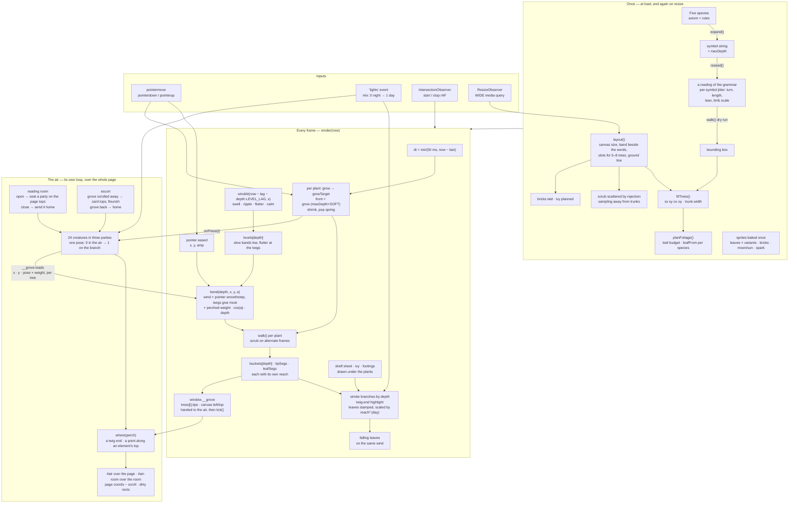
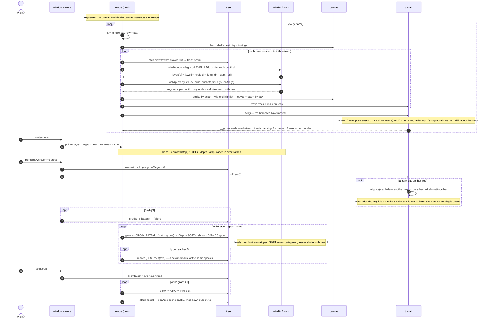

# neovand.github.io

Personal homepage — a gallery of interactive demos, simulations, and tools.

**Live site:** https://neovand.github.io


## Structure

```
/               ← gallery homepage
/media/         ← thumbnails, and the moon behind the grove
/media/fonts/   ← Inter, self-hosted (SIL Open Font License, see OFL.txt)
/media/legacy/  ← figures for the older projects, shown in their modals
/media/mit/     ← Media Lab project thumbnails, local copies
/media/papers/  ← first five pages of each paper, rendered for the deck fans
/papers/        ← the PDFs themselves
/archive/       ← original Three.js network visualization (preserved)
```

Every image the page loads is served from this repo. Nothing hotlinks, and
nothing on the critical path comes from a third-party origin.

## The sky

The page does not have a background colour so much as weather. One full-screen
fragment shader sits behind the whole document: by day a cloudscape built from
a gyroid FBM — the same family of noise as Leon Denise's [Cloudy Blue
Sky](https://www.shadertoy.com/view/DlKXWm), with its scrolling blue-noise
texture dropped in favour of a wider threshold, so cloud edges dissolve rather
than fizz and nothing has to be downloaded — and by night a thin star field
crossed by the Milky Way, which arrives as a crowding of stars rather than a
grey smear, with a meteor every half-minute or so.

It runs at half the display's rate on a buffer capped well under a retina
viewport's worth of pixels, stops entirely when the tab is hidden, and draws a
single still frame under `prefers-reduced-motion`. If WebGL is unavailable the
flat `--bg` underneath is all you get, and nothing else changes.

## The grove

The header is a canvas of five L-system trees over a thicket of smaller ones,
each grammar giving a different silhouette. They bend under a shared wind field
built from layered value noise, sampled a little later at each branching level
so a gust travels up the plant instead of swinging every part at once. Moving
the pointer pushes them aside; pressing a tree makes it withdraw into itself,
twigs first, and releasing grows it back. Two parties of birds — fireflies,
after dark — sit up on the crowns of two of the trees and cross to another
when theirs is pressed, or when they feel like it (see [The air](#the-air)).

In daylight each species carries its own foliage: a leaf shape and a green,
baked into small sprites at twelve angles and three variants, so a branch end
costs one blit rather than a path. How far in the canopy reaches is measured
per species from its own twig spacing — the five grammars differ enough that a
fixed depth leaves one bald and turns another into a solid lump — and the inner
levels are drawn from a shaded copy of the same leaves, which is what stops a
dense tree reading as a green tube. Each segment records how far out it has
grown, and its leaf is scaled by the cube of that, so pressing a tree shrinks
the foliage away with the twigs instead of switching it off leaf by leaf.

The moon is the CC0 "full moon" drawing by gnokii (Open Clipart, via Wikimedia
Commons), which requires no attribution. It is also the favicon, rendered over
a night ground with the same glow it has on the page.

### How it fits together

Everything below lives in one script in `index.html`, under the heading
`Grove: L-system trees under a shared wind`. The expensive work — expanding
the grammars, dealing each tree its reading, fitting the stand to the column,
baking sprites — happens once at load and again on resize; a frame is one
`walk()` per plant, driven by the wind field, the pointer and each tree's
growth, and the segments it collects are stroked straight onto the canvas.



### A frame, and a press

The loop only runs while the canvas is on screen. A press picks the nearest
trunk and sends its `growTarget` to zero; the tree draws itself back in at a
fixed rate, so a tree with more branching levels takes the same time as one
with fewer, and letting go sends every tree back up with a small overshoot
that rings down.



## The air

The birds and the fireflies are the same two dozen creatures, drawn by
whichever light the lamp gives: after dark a small white speck that blinks on a
twig end or drifts about the crown on a slow wandering course before it settles
again; by day a sparrow, sitting up on the crown of a tree where it shows
against the sky, hopping to the next twig, turning to look the other way,
flicking its tail. They keep to the grove in
two parties, one to a tree, and a party crosses to another tree every twenty
seconds or so — banking together by day, since birds in a flock curve the same
way, each on its own path by night — or at once when the tree it sits on is
pressed. A hand coming close sends a bird to another twig and a firefly into
the air.

Three things about the drawing were worth getting right. The wings are drawn
in the body's own frame and mirrored across it — the bird seen head-on, which
is the reading everyone has of one crossing the sky — and they sweep further
back the wider they open, so a wing at full stretch is a scythe rather than a
crossbar. Drawn instead in the window's frame, as they were at first, a
horizontal line ran through a body that turned to its heading, and it read
unmistakably as legs: the thing was a spider. The flight is a bounding one, a
burst of flapping and then the wings shut against the body while it arcs,
which is what a small bird actually does and what makes a dozen of them
crossing together read as birds rather than as marks.

And there are not two drawings. A sitting bird and a flying one drawn
separately have to be swapped at the moment of landing, and that swap is the
one thing anybody sees. So there is a single bird and a single number, `pose`,
saying how far it has come out of the air onto the branch, and every dimension
is read off it: the body swings from its heading round to the small backward
lean of a bird on a branch, rises off the perch onto its legs, puffs up, lifts
its head and drops its tail, while the wings run out of the beat, up into the
spread it brakes on, and down onto its back. It reaches for the branch about a
third of a second out and lands facing the way it flew. The same number run
backwards is the takeoff.

`pose` is also the weight. These are thin trees, and a bird that sits on one
without bending it is a sticker. The air hands the grove what each tree is
carrying and where, and the load turns the wood under it toward the ground:
how much of a turn goes into dropping the tip is `cos` of the branch's own
heading, so an upright trunk does not sag and a level twig gives all it can,
and the outer levels, being thinner, give the most. Because the weight arrives
with the feet, the branch dips as a bird settles onto it and comes back up as
it leaves, with no spring of its own needed. There is a ceiling on it, though,
because weight adds up: a party that happened to gather on one branch was
bending it many times as far as a single bird did, and that is the point where
the effect stops reading as weight and starts reading as a fault. Past the cap
another bird is another bird, not another branch's worth of droop. A full
party moves the twig ends of its tree by a few pixels — enough to notice if
you are watching one, not enough to change the shape of the stand. Grab a tree the birds are on and
they are off it almost together, riding the twig down for as long as it is
under them and drawn flying the moment it is not — a bird cannot wait its turn
in mid-air.

A sparrow on anything flat does not walk, it hops — both feet at once, a short
low arc, two or three in a row and then a stop to look about — so along the top
of a page, a card or the download pill that is what it does. The distance is
measured off the bird rather than off the surface, since a hop is a hop and not
a stride whether it is on a card or on a thirty-six-page paper; at the end of
the run it turns round rather than walking off the edge. A twig has nowhere to
hop to, so there it flies to the next one instead, and a point on the flourish
is a place to stand rather than a surface, so there it only turns. Sitting
perfectly still and then flipping round on the spot, which is what they did
before, is the one thing a sparrow never does.

A sparrow is one muted earth brown and not much of it, which took two goes to
arrive at. Black birds were holes cut in the sky, and the eye goes to the holes
rather than to the grove. Colours dealt from the shelf's three clays were the
other way wrong — too light, and varied enough that a stand of them read as a
handful of different birds scattered about, which is busier than a flock. One
narrow family, a shade darker than the wall below, with only enough difference
between individuals that they are not stamped from the same die.

The firefly's light is white, not the yellow-green a firefly really is. By
night this page is a greyscale drawing — black trees to white twigs, a white
moon, the colour taken out of the brick — and one coloured thing in it is a
spot of paint on a pencil study. What keeps the specks from being lost among
the white twig ends is not their hue; it is that they sit up on the crown, and
that a third of them are adrift at any moment.

Nobody is ever put down where they will end up. One that is already sitting on
the first frame and starts moving on the second is a cut-out that has been
remembered to; one that comes into the picture has been somewhere. So they
arrive from off the canvas — the birds down out of the sky, on an arc that
dips below the straight line so they drop and then flatten into the branch,
the fireflies up from the grass, which is where fireflies come from — either
on the opening's clock or, where there is no opening, on their own.

They live in a script of their own, after the grove's, on a sheet the size of
the window rather than the grove's canvas: everything is kept in page
coordinates and taken to the window at draw time, so a scroll carries a
perched bird along with its branch and leaves a flying one where it is in the
air, and a flight can go anywhere on the page. The grove hands over what they
need through `window.__grove` — the twig ends of every tree, fresh each frame
it draws, where its canvas sits on the page, and a word when a tree is pressed
or the opening begins — and the air runs its own loop, which sleeps once
nothing is in view or on the move. The sheet sits above the page and below the
lamp cord, and below the reading room and the modals, whose backdrops should
cover a bird left sitting on the grove as they cover the grove.

That is why the reading room has a second sheet, inside it and over its
backdrop. Opening a paper brings a party in — the one that did not go last
time — to sit along the tops of the pages in view, three to a page, and on the
close button and the download pill; by night they keep more to the air over
the dark than to the paper. They ride the pages as the stream scrolls, and one
whose page has gone out from under it moves after a moment to a page that is
still in view; when the room closes they leave with the pages. The grove is
screens away by then, so a flight to or from it is not flown across the whole
page — it would cross at a streak — but from the edge of the window: they come
in from just outside, and go out at the edge and are set down at the far end
unseen.

A few of them do not stay in the grove once the visitor has left it. When the
grove has scrolled away this escort comes down the page after the reader and
sits along the top edges of the cards near the top of the window, or up on
the flourish between sections — which by day is a branch — and follows when a
perch is left behind, at its own pace rather than the scrollbar's; when the
grove comes back into view they go home to it. Under `prefers-reduced-motion`
nothing flies: arrivals fade in where they land, and nobody hops, drifts or
follows.

### The blank page

Worth recording, since the symptom was alarming and the cause was three
scripts away from it. Now and then a reload would come up with the header and
nothing under it — no cards, no papers, no earlier work — and no amount of
scrolling brought them back.

Everything in the gallery starts at zero opacity and is revealed by an
`IntersectionObserver` that is only attached once the opening announces it has
finished. The opening types the bio by holding a Range over the part not yet
written, and the character count came from `Math.min(1, (now - t0) / dur)` —
clamped at the top and not at the bottom. A frame's timestamp is the moment
the frame began, but `t0` was read part-way into an earlier frame, after the
grove and everything else in it had run; so on a fast display, or a heavy
first frame, the next timestamp can land a millisecond or two *before* `t0`.
That is a negative character count, a negative offset into a Range, and a
throw. The throw killed the loop before it could announce anything.

What made it unrecoverable was the escape hatch. Scrolling is supposed to land
the opening immediately, but it checks a `done` flag — and the grove sets that
flag when *its* part of the opening ends, which happens regardless. So by the
time anyone scrolled, the skip believed there was nothing left to skip, and
the gallery waited for an event that was never coming again.

Both ends are fixed: the count is clamped at zero, and the gallery no longer
waits on trust. If word has not come by the time the opening should long since
have ended, it starts anyway. Nothing in the header is worth a blank page.

## The glass

The profile links and the filter chips are panes of glass rather than tinted
rectangles. Three things make the difference: a rim gradient painted into a
one-pixel ring by masking a box against its own content box (a border cannot
hold a gradient), two inner lights along the top and bottom edges, and a
refraction at the rim.

The refraction is an SVG displacement map built per element, at load and on
resize, from that element's own rounded-rect signed distance field — neutral
grey through the middle, ramping toward the outward normal inside a band at
the edge, so the backdrop is sampled from further out the nearer the rim and
piles up there the way it does under real glass. Only Chromium will run an SVG
filter inside a `backdrop-filter`, so it arrives through a custom property that
script sets and no other engine ever receives. That property is declared empty
in `:root` on purpose: without a declared default, `var()` on an undefined
property is invalid at computed-value time and would take the whole
`backdrop-filter` with it, blur included.

Two things kept daylight from looking like glass. The ring sat one pixel inside
the pane, because an absolutely positioned box is offset from its container's
*padding* box and these carried a transparent border — so the edge was a pixel
of plain tint next to a pixel of ring, twice as thick as it should be. And the
ring was white at both ends, which against a white pane is not an edge but an
outline. On a bright ground the sides of real glass show the darker, compressed
view through the bevel and only two short arcs catch the light, so that is what
the daylight rim does now.

The gallery cards are panes in both themes. A solid card on a sky is a hole cut
in the weather. Their tint and blur were picked by measurement rather than by
eye: a star in this sky is about one device pixel across, so blur destroys it
quadratically while transparency only costs it linearly — at 3.5px barely a
tenth survived, at 1.8px about half does. Daylight has far more room, since the
description text still measures near 6:1 against the frost at half the tint it
started with, so the cloud comes through much more than it did.

## On a phone

Below 900px the page stacks: the grove above the words, both the width of the
screen. The grove takes its height from the screen there — about half of the
first one, capped — so the trees stand at the same proportions they have
beside the bio on a wide screen, and a phone plants four or five of them
rather than squeezing in the wide screen's five to eight.

The bio writes itself over the finished paragraph rather than into it: the
text is all there from the first frame, laid out once, and the part not yet
typed is painted with no colour through a CSS custom highlight, with the caret
carried along as a separate box. Typing by truncating the text nodes re-broke
the lines on every frame under `text-wrap: pretty` — Safari re-solves the whole
paragraph — which on a twenty-line column read as the bio shivering. Browsers
without the Highlight API get the older way, under greedy breaking.

The lamp cord hangs from the top of the *page* on a stacked layout, over the
grove, and scrolls away with it — fixed to the window it rode down over the
right end of every line. A tap on the knob switches the lights on a touch
screen; dragging still works, but a short drag on a phone is how the page
scrolls. The four profile links stay one row, a size down, with Google Scholar
going by its surname; the filter chips are one strip that scrolls, and the one
you tap is brought to the middle of it. `viewport-fit=cover` lets the sky run
under the notch and the home bar, with the content held inside the safe area,
so a phone held sideways no longer shows a strip of the flat fallback colour
either side of the weather.

To try it on a real phone without deploying: serve the folder and open the
Mac's address on the phone over the same Wi‑Fi —

```bash
python3 -m http.server 8899
```

then `http://<your-mac's-ip>:8899/` (System Settings → Wi‑Fi → Details shows
the address; `ipconfig getifaddr en0` prints it). Safari's Web Inspector will
attach to the phone from the Mac's Develop menu. Playwright's WebKit build is a
fair stand-in for Mobile Safari when a device is not to hand.

## The section flourishes

The dividers between sections are one calligraphic ornament, split into its
seventeen component strokes. Each is pivoted on the end that joins the middle
and delayed by how far out it sits, so when the divider scrolls into view the
flourish unrolls from the centre and the terminal spirals arrive last.

In daylight it stops being ink and becomes a branch: brown where it leaves the
middle, green out at the curls, with leaves hung along it. The leaves are grown
on the left half only — anchored on points sampled from the strokes' own
outlines, so each one sits on the ink rather than beside it — and mirrored
across the centre, because a figure this symmetrical shows any drift at once.
They are in the markup at night too, painted with nothing: removing them would
throw off the measurement that decides how the flourish unrolls.

The ornament is from a text-divider set by Vecteezy. **Free Vecteezy downloads
require attribution** — check the licence on the original download and add the
credit it asks for, or swap in an asset that does not need one.
